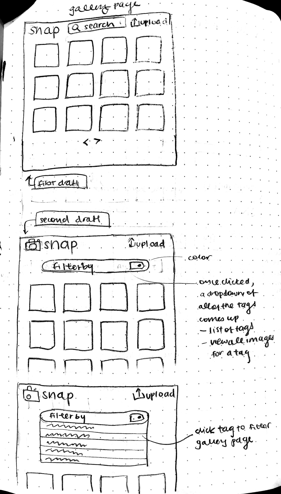
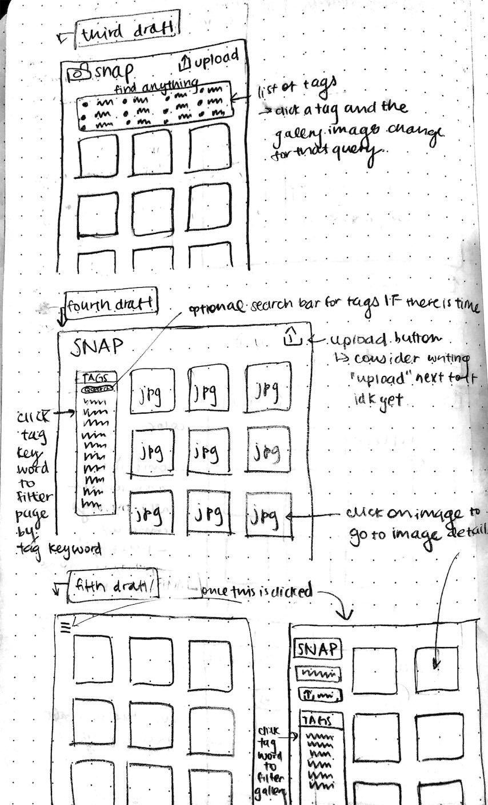
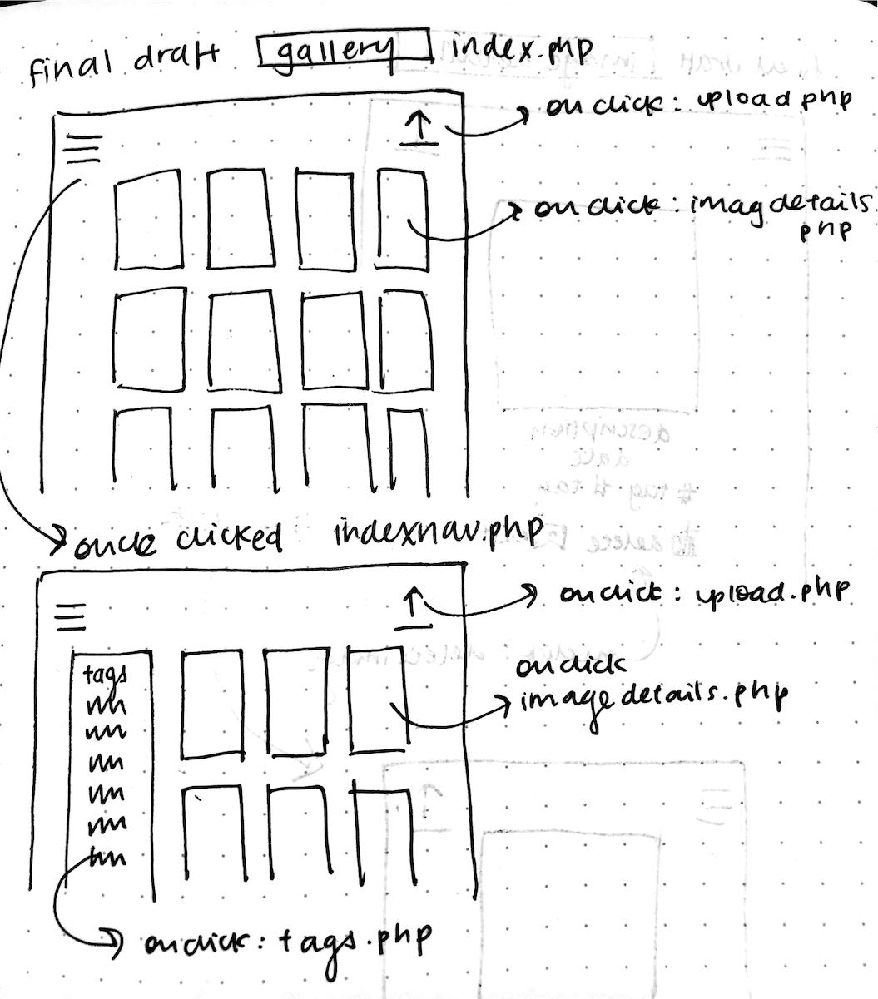
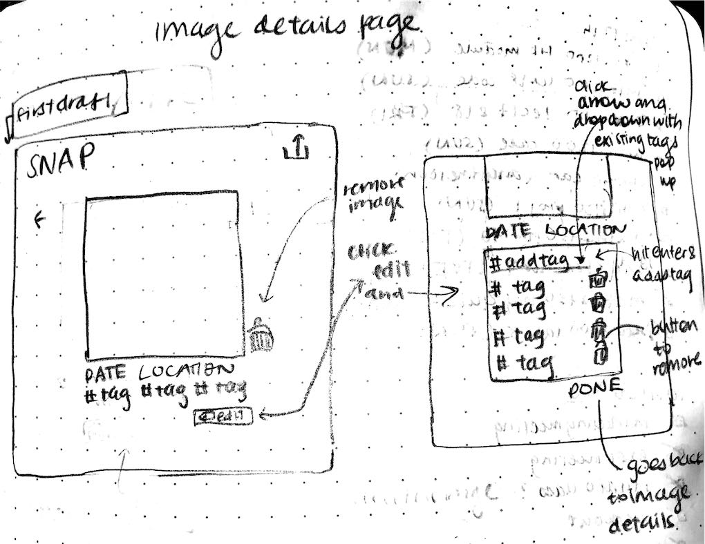
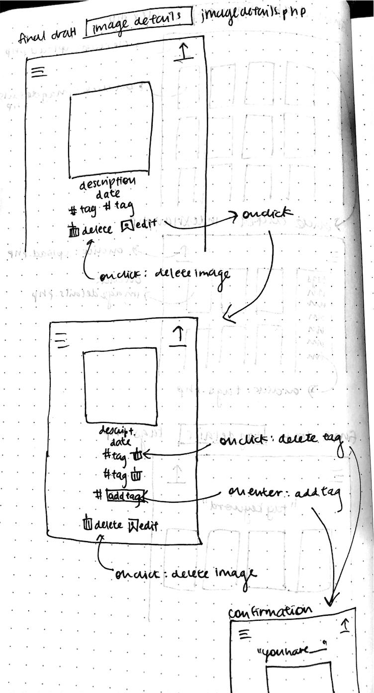
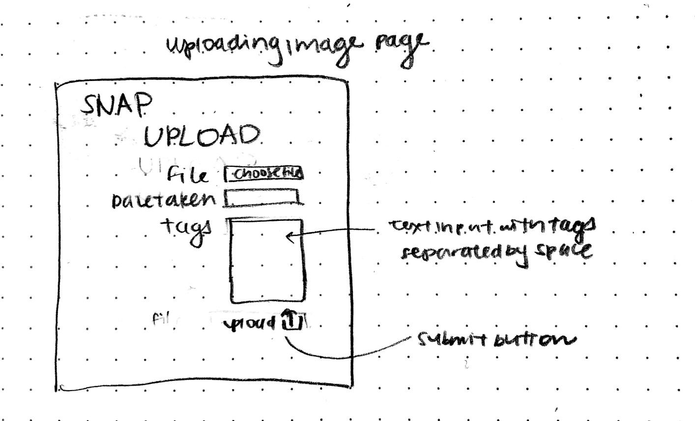
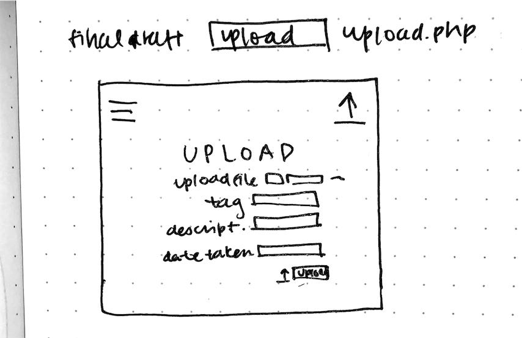

# VSCO-de: the Design Journey

## Target Audience(s)
> Tell us about your target audience(s).

My target audience is for the photographers who like to travel and like their photos to be at the center of the showcase. Their photos have a great depth of color and composition which stand out best against a plain background. This audience likes to adventure and explore, and thus the user will be able to see all images at once in the gallery view and in the tag view. This website reflects this target audience with minimal design to let the photos speak for themselves.

## Design Process
> Document your design process. Show us the evolution of your design from your first idea (sketch) to design you wish to implement (sketch). Show us the process you used to organize content and plan the navigation (card sorting), if applicable.
> Label all images. All labels must be visible in VS Code's Markdown Preview.
> Clearly label the final design.

Gallery Page Design

Tag Page Design
![] (tagfinal.jpg)

Image Details Page

Upload Page

## Design Patterns
> Explain how your site leverages existing design patterns for image galleries.
> Identify the parts of your design that leverage existing design patterns and justify their usage.
> Most of your site should leverage existing patterns. If not, fully explain why your design is a special case (you need to have a very good reason here to receive full credit).

- The gallery page is focused on the pictures
    - Simplicity
    - Good overview
- Click on the image to learn more
    - One stop for everything related to that image
    - Simplicity
    - Adding, removing tags, deleting image is all done on the same page
- Icons are used instead of words
    - Intiuitive icons
    - Streamlined website

## Gallery Step-by-Step Instructions

Viewing all images in your gallery:
1. Scroll through the index.php. This is all of the images in the gallery.

View all images for a tag:
1. Click the menu (hamburger) icon on the top left corner from index.php.
2. On the left hand side navigation bar, click the keyword of the tag you would like to view.
3. All of the images in that specific tag will appear.

View a single image and all the tags for that image:
1. Click any image in the gallery on index.php
2. Look underneath the photo for all of the image details and corresponding tags.

How to upload a new image:
1. Click the upload button on the top right corner of index.php.
2. Upload image file.
3. Add tag, description, and date taken.
4. Click Upload button at the bottom of the form.
5. Edit form according to feedback and submit again, if applicable.
6. View uploaded image on confirmation page. Optionally click image to view uploaded image details.

How to delete an image:
1. Click any image in the gallery on index.php
2. Underneath the image, click Delete Image.
3. View confirmation of deletion.

How to view all tags at once:
1. Click the menu (hamburger) icon on the top left corner from index.php.
2. On the left hand side navigation bar, view all of the tags available.

How to add a tag to an existing image:
1. Click any image in the gallery on index.php
2. Underneath the image, click Edit Tags.
3. Type any tag keyword you would like to input into the 'add tag' text input
4. Hit enter
5. View confirmation or additional feedback on added tag.
6. If the added tag was one already tagged to the image, or if the added tag was empty, feedback will pop up, and tag will not be added.

How to remove a tag from an existing image:
1. Click any image in the gallery on index.php
2. Underneath the image, click Edit Tags.
3. Click the trash icon next to the tag you would like to remove.
4. View confirmation of removed tag.
